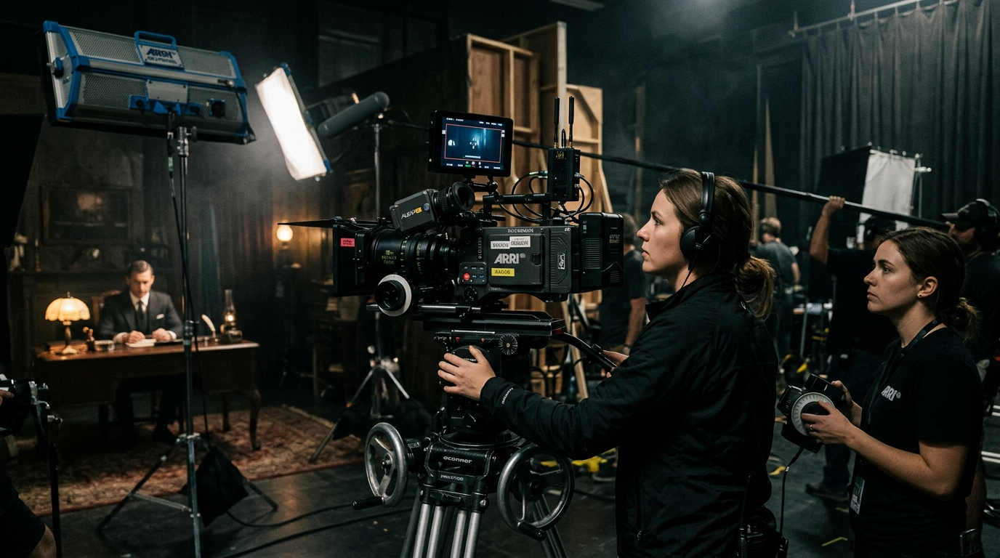

# KINETIC. Studio 🎬



**KINETIC. Studio** is a high-end, premium portfolio and corporate landing page designed for creative agencies, cinematography studios, and digital art collectives. Built with the latest modern web technologies, it features an ultra-smooth, immersive user experience tailored for high-converting brand milestones.

## ✨ Key Features

- **Immersive Smooth Scrolling**: Integrated with [Lenis](https://lenis.studiofreight.com/) for a buttery-smooth, fluid scrolling experience across all devices.
- **Magnetic UI Elements**: Custom magnetic hover effects on buttons and interactive elements using [GSAP (GreenSock)](https://gsap.com/).
- **Dynamic ScrollSpy Navigation**: Intelligent top navigation bar that automatically synchronizes and highlights the active section as the user scrolls.
- **Cinematic & Dark Mode Aesthetic**: A sleek, modern dark theme utilizing a refined color palette (Deep blacks, Cyan, Orange, and Neon accents) designed to make visual portfolios pop.
- **Custom Cursor**: Replaces the default cursor with a dynamic, stylized dot and ring that interacts with clickable elements.
- **Responsive Layout**: Fully responsive and optimized for both desktop and mobile viewing with a seamless mobile menu.

## 🛠️ Tech Stack

- **Framework**: [React 18](https://react.dev/)
- **Build Tool**: [Vite](https://vitejs.dev/)
- **Styling**: [Tailwind CSS](https://tailwindcss.com/)
- **Animations**: [GSAP](https://gsap.com/) & CSS Transitions
- **Scroll Hijacking**: [Lenis](https://lenis.studiofreight.com/)
- **Icons**: [Lucide React](https://lucide.dev/)
- **Language**: TypeScript

## 🚀 Quick Start

Follow these steps to run the project locally on your machine.

### Prerequisites

Make sure you have [Node.js](https://nodejs.org/) installed on your machine.

### Installation

1. Clone the repository:
   ```bash
   git clone https://github.com/yusuftunga1/creative-studio.git
   ```
2. Navigate to the project directory:
   ```bash
   cd creative-studio
   ```
3. Install dependencies:
   ```bash
   npm install
   ```
4. Start the development server:
   ```bash
   npm run dev
   ```
5. Open your browser and visit `http://localhost:5174/`.

## 📁 Project Structure

```
creative-studio/
├── public/
│   └── images/              # Local image assets (Cinematic, FPV, Web3, Architecture)
├── src/
│   ├── components/          # Reusable UI components (Hero, Navbar, Services, WorkGallery, etc.)
│   ├── hooks/               # Custom React hooks (e.g., useMousePosition)
│   ├── App.tsx              # Main application root and ScrollSpy logic
│   ├── index.css            # Global styles and Tailwind configuration
│   └── main.tsx             # React DOM rendering entry point
├── .vscode/                 # VSCode workspace settings (launch.json)
├── package.json             # Project metadata and dependencies
└── tailwind.config.js       # Tailwind CSS configuration
```

## 🤝 Contributing

Contributions, issues, and feature requests are welcome! Feel free to check the [issues page](https://github.com/yusuftunga1/creative-studio/issues).

## 📄 License

This project is proprietary. © 2026 KINETIC STUDIOS. All rights reserved.
